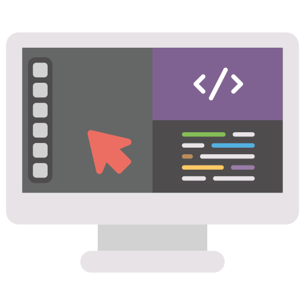
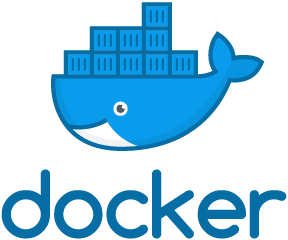
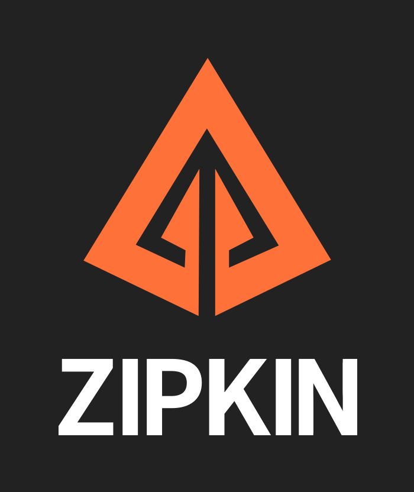
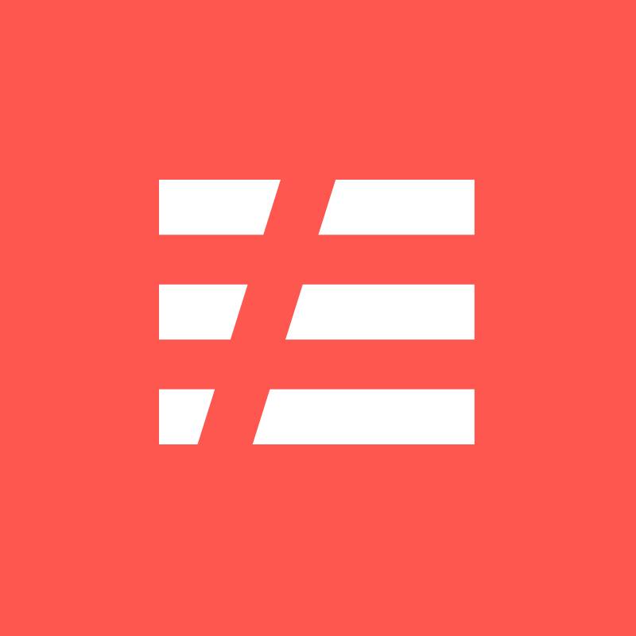

<!-- ALL-TOPICS-LIST:START -->
<!-- prettier-ignore-start -->
<!-- markdownlint-disable -->

<table>

  <tr>
    <td align="center"><a href="projects/1-devops pipelines/java_build_pipeline.md"> <b>DevOps App Build Pipelines</b></a></td>
    <td align="center"><a href="projects/1-devops pipelines/java/java_build_pipeline.md"> <b>Java Build Pipeline</b></a></td>
    <td align="center"><a href="projects/1-devops pipelines/javascript/javascript_build_pipeline.md"> <b>Javascript Build Pipeline</b></a></td>
    <td align="center"><a href="projects/1-devops pipelines/php/php_build_pipeline.md"> <b>PHP Build Pipeline</b></a></td>
    <td align="center"><a href="projects/1-devops pipelines/dot-net/dot_net_build_pipeline.md"> <b>.NET Build Pipeline</b></a></td>
    <td align="center"><a href="projects/1-devops pipelines/python/java_build_pipeline.md"> <b>Python Build Pipeline</b></a></td>
    <td align="center"><a href="projects/1-devops pipelines/csharp/csharp.md"> <b>C# Build Pipeline</b></a></td>
  </tr>

  <tr>
    <td align="center"><a href="topics/software_development/README.md"> <b>CI/CD Tools</b></a></td>
    <td align="center"><a href="projects/22-ci-cd tools/github/github.md"> <b>GitHub Actions</b></a></td>
    <td align="center"><a href="projects/22-ci-cd tools/gitlab/gitlab.md"> <b>GitLab</b></a></td>
    <td align="center"><a href="projects/22-ci-cd tools/Octopus Deploy/octopus.md"> <b>Team City / Octopus Deploy</b></a></td>
  </tr>

  <tr>
      <td align="center"><a href="topics/cloud/README.md"> <b>Cloud Computing</b></a></td>
      <td align="center"><a href="projects/2-cloud computing/aws/aws_table.md"> <b>AWS</b></a></td>
      <td align="center"><a href="projects/2-cloud computing/azure/azure_table.md"> <b>Azure</b></a></td>
      <td align="center"><a href="projects/2-cloud computing/gcp/gcp_table.md"> <b>Google Cloud Platform</b></a></td>
      <td align="center"><a href="projects/2-cloud computing/openstack/openstack.md"> <b>OpenStack</b></a></td>
  </tr>

  <tr>
    <td align="center"><a href="topics/software_development/README.md"> <b>Software Development</b></a></td>
    <td align="center"><a href="projects/3-software development/c-sharp/csharp.md"> <b>C#</b></a></td>
    <td align="center"><a href="projects/3-software development/go-lang/go-lang.md"> <b>Go-lang</b></a></td>
    <td align="center"><a href="projects/3-software development/javascript/javascript.md"> <b>Javascript</b></a></td>
    <td align="center"><a href="projects/3-software development/dot-net/dot-net.md"> <b>.NET</b></a></td>
  </tr>

  <tr>
    <td align="center"><a href="topics/software_development/README.md"> <b>Scripting</b></a></td>
    <td align="center"><a href="projects/4-scripting/python"> <b>Python</b></a></td>
    <td align="center"><a href="projects/4-scripting/bash"> <b>Bash</b></a></td>
    <td align="center"><a href="projects/4-scripting/powershell"> <b>Powershell</b></a></td>
  </tr>

  <tr>
    <td align="center"><a href="topics/software_development/README.md"> <b>Containerization</b></a></td>
    <td align="center"><a href="projects/23-containerization/docker/docker.md"> <b>Docker</b></a></td>
    <td align="center"><a href="projects/23-containerization/podman/podman.md"> <b>Podman</b></a></td>
  </tr>

<!-- 
  <tr>
    <td align="center"><a href="#operating-system"> <b>Cloud Native Design Patterns</b></a></td>
    <td align="center"><a href="projects/3-software development/dot-net/dot-net.md"> <b>Reliability</b></a></td>
    <td align="center"><a href="#virtualization"> <b>Scalability</b></a></td>
    <td align="center"><a href="#virtualization"> <b>Efficiency</b></a></td>
    <td align="center"><a href="#virtualization"> <b>Security</b></a></td>
  </tr>

  <!-- <tr>
    <td align="center"><a href="#operating-system"> <b>Amazon Web Service (AWS) </b></a></td>
    <td align="center"><a href="projects/3-software development/dot-net/dot-net.md"> <b>Amazon Elastic Kubernetes Service (EKS)</b></a></td>
    <td align="center"><a href="#virtualization"> <b>Amazon Elastic Beanstalk</b></a></td>
    <td align="center"><a href="#virtualization"> <b>AWS Lambda</b></a></td>
  </tr> -->

  <!-- <tr>
    <td align="center"><a href="#operating-system"> <b>Azure</b></a></td>
    <td align="center"><a href="projects/3-software development/dot-net/dot-net.md"> <b>Azure App Services</b></a></td>
    <td align="center"><a href="#virtualization"> <b>Azure Kubernetes Service</b></a></td>
    <td align="center"><a href="#virtualization"> <b>Azure Functions</b></a></td>
  </tr> -->

  <!-- <tr>
    <td align="center"><a href="#operating-system"> <b>Google Cloud Platform (GCP) </b></a></td>
    <td align="center"><a href="projects/3-software development/dot-net/dot-net.md"> <b>Google Kubernetes Engine (GKE)</b></a></td>
    <td align="center"><a href="#virtualization"> <b>Google App Engine</b></a></td>
    <td align="center"><a href="#virtualization"> <b>Google Cloud Functions</b></a></td>
  </tr> -->

  <tr>
      <td align="center"><a href="topics/observability/README.md"> <b>Server Administration</b></a></td>
      <td align="center"><a href="projects/6-server administration/windows server/windows server.md"> <b>Windows</b></a></td>
      <td align="center"><a href="projects/6-server administration/linux server/apache server.md"> <b>Linux</b></a></td>
  </tr>
  
  <tr>
      <td align="center"><a href="topics/databases/README.md"> <b>Databases</b></a></td>
      <td align="center"><a href="projects/7-database/mysql/mysql.md"> <b>MySQL</b></a></td>
      <td align="center"><a href="projects/7-database/mongodb/MongoDB.md"> <b>MongoDB</b></a></td>
      <td align="center"><a href="projects/7-database/postgressql/postgresql.md"> <b>PostrgesSQL</b></a></td>
      <td align="center"><a href="#testing"> <b>CosmosDB</b></a></td>
      <td align="center"><a href="projects/7-database//database automation/db_automation.md"> <b>Database Automation</b></a></td>
  </tr>

  <tr>
      <td align="center"><a href="topics/databases/README.md"> <b>Data Processing</b></a></td>
      <td align="center"><a href="projects/8-data processing/azure data bricks.md"> <b>Data Bricks</b></a></td>
      <td align="center"><a href="#mongo"> <b>Azure Data Lake</b></a></td>
      <td align="center"><a href="projects/8-data processing/azure data factory.md"> <b>Azure Data Factory</b></a></td>
      <td align="center"><a href="#testing"> <b>Apache Spark</b></a></td>
  </tr>
  
  <tr>
      <td align="center"><a href="topics/terraform/README.md"> <b>Iac/Configuration Management</b></a></td>
      <td align="center"><a href="projects/9-configuration management/terraform/terraform.md"> <b>Terraform</b></a></td>
      <td align="center"><a href="projects/9-configuration management/ansible/ansible.md"> <b>Ansible</b></a></td>
      <td align="center"><a href="projects/9-configuration management/packer/packer.md"> <b>Packer</b></a></td>
  </tr>

  <tr>
      <td align="center"><a href="topics/Monitoring/README.md"> <b>Monitoring</b></a></td>
      <td align="center"><a href="projects/10-monitoring/prometheus/prometheus.md"> <b>Prometheus</b></a></td>
      <td align="center"><a href="projects/10-monitoring/grafana/grafana.md"> <b>Grafana</b></a></td>
      <td align="center"><a href="projects/10-monitoring/datadog/datadog.md"> <b>Datadog</b></a></td>
      <td align="center"><a href="projects/10-monitoring/elastic search/elasticSearch.md""> <b></b>Elastic Search</a></td>
      <td align="center"><a href="projects/10-monitoring/kibana/kibana.md""> <b>Kiabana</b></a></td>
      <td align="center"><a href="projects/10-monitoring/elk/elk.md""> <b>Logstash</b></a></td>
  </tr>

  <tr>
      <td align="center"><a href="topics/Distributed Tracing/README.md"> <b>Distributed Tracing</b></a></td>
      <td align="center"><a href="projects/11-distributed tracing/application-insights/application-insights.md"> <b>Application Insights</b></a></td>
      <td align="center"><a href="projects/11-distributed tracing/open-telemetry/open-telemetry.md.md"> <b>Open Telemetry</b></a></td>
      <td align="center"><a href="topics/datadog/README.md"> <b></b>Zipkin</a></td>
      <td align="center"><a href="topics/grafana/README.md"> <b>Jaegar</b></a></td>
  </tr>
  
  <tr>
      <td align="center"><a href="topics/observability/README.md"> <b>Networking</b></a></td>
      <td align="center"><a href="projects/12-networking/azure networking/az_virtual_network.md"> <b>Azure express route</b></a></td>
      <td align="center"><a href="projects/12-networking/azure networking/az_virtual_network.md"> <b>Azure virtual network</b></a></td>
      <td align="center"><a href="projects/12-networking/azure networking/az_virtual_network.md"> <b>Azure Load Balancer</b></a></td>
  </tr>
  
  <tr>
      <td align="center"><a href="topics/observability/README.md"> <b>Security</b></a></td>
      <td align="center"><a href="#prometheus"> <b>Azure Firewall</b></a></td>
      <td align="center"><a href="topics/circleci/README.md"> <b>Azure Sentinel</b></a></td>
      <td align="center"><a href="topics/circleci/README.md"> <b>Azure Key Vault</b></a></td>
      <td align="center"><a href="projects/13-security/hashicorp vault.md"> <b>HashiCorp Vault</b></a></td>
  </tr>
  
  <tr>
      <td align="center"><a href="topics/databases/README.md"> <b>Testing</b></a></td>
      <td align="center"><a href="projects/14-testing/functional.md"> <b>Functional Testing</b></a></td>
      <td align="center"><a href="projects/14-testing/functional.md"> <b>Unit Testing</b></a></td>
      <td align="center"><a href="projects/14-testing/functional.md"> <b>Integration Testing</b></a></td>
  </tr>
  
  <tr>
    <td align="center"><a href="topics/soft_skills/README.md"> <b>GitOps</b></a></td>
    <td align="center"><a href="projects/15-gitops/argocd/argocd.md"> <b>Argo CD</b></a></td>
  </tr>

   <tr>
    <td align="center"><a href="topics/chaos_engineering/README.md"> <b>Chaos Engineering</b></a></td>
    <td align="center"><a href="projects/16-chaos engineering/k6.md"> <b>k6</b></a></td>
    <td align="center"><a href="#elastic"> <b>Litmus Chaos</b></a></td>
   </tr>

   <tr>
    <td align="center"><a href="topics/chaos_engineering/README.md"> <b>Message Queueing</b></a></td>
    <td align="center"><a href="projects/18-message queueing/rabbitmq/rabbitmq.md"> <b>RabbitMQ</b></a></td>
    <td align="center"><a href="projects/18-message queueing/kafka/kafka.md"> <b>Apache Kafka</b></a></td>
   </tr>

   <tr>
    <td align="center"><a href="topics/chaos_engineering/README.md"> <b>Helm</b></a></td>
    <td align="center"><a href="projects/19-helm/helm.md"> <b>Helm</b></a></td>
   </tr>

   <tr>
    <td align="center"><a href="topics/chaos_engineering/README.md"> <b>DevSecOps</b></a></td>
    <td align="center"><a href="projects/19-helm/helm.md"> <b>CheckMarx/Jfrog XRAY</b></a></td>
    <td align="center"><a href="projects/19-helm/helm.md"> <b>SonarQube/Owasp ZAP</b></a></td>
    <td align="center"><a href="projects/19-helm/helm.md"> <b>PrismaCloud/Twistlock</b></a></td>
   </tr>

   <tr>
    <td align="center"><a href="topics/chaos_engineering/README.md"> <b>Architecture Design</b></a></td>
    <td align="center"><a href="projects/17-architecture design/microservices-linkerd.md"> <b>Monolith to Microservices - Linkerd</b></a></td>
    <td align="center"><a href="projects/17-architecture design/azure functions.md"> <b>FaaS-ServerLess - Azure Functions</b></a></td>
   </tr>

   <tr>
    <td align="center"><a href="topics/chaos_engineering/README.md"> <b>Resume</b></a></td>
    <td align="center"><a href="projects/20-resume/lexisnexis.md"> <b>LexisNexis</b></a></td>
    <td align="center"><a href="projects/20-resume/ashley_furniture.md""> <b>Ashley Furniture</b></a></td>
    <td align="center"><a href="projects/20-resume/microsoft.md""> <b>Microsoft</b></a></td>
   </tr>
   
</table>

<!-- markdownlint-enable -->
<!-- prettier-ignore-end -->
<!-- ALL-TOPICS-LIST:END -->

# Azure Cloud Native Solution Architecture Diagram

Below is a diagram of the solution architecture we are building towards. This is An example solution would be an internal web application that allows employees to access and manage their company benefits. The web application would be hosted in an AKS cluster and would be composed of multiple microservices such as user management, claims management, and plan management. Users would be authenticated via Azure Active Directory and access to the web application would be restricted via Azure Virtual Network and Network Security Groups. The web application would be load balanced via Azure Load Balancer with Nginx and would be able to handle high traffic. The application data would be stored in Azure MySQL Flex Server and would be highly available and scalable. Azure Monitor would be used to monitor the performance of the web application, and Azure Container Registry would be used to store and manage the Docker images used by the application. the entire application would be build using ci/cd in a github actions pipeline.

### 

## Pre-requisites

### Part 1: [Setup Terraform Enterprise](https://developer.hashicorp.com/terraform/enterprise)

- [ ] Task 1: Create github repository
- [ ] Task 2: Create Terraform enterprise workspace
- [ ] Task 3: Add provider.tf file in repository
- [ ] Task 4: Configuring a New Workspace
- [ ] Task 5: Add environment variables
- [ ] Task 6: Add Terraform variables
- [ ] Task 7: Test Run Trigger

### Part 2: Setup Vnet's, Resource Group's, and ACR

- [ ] Task 1: Create resource groups for each VNet
- [ ] Task 2: Decide the CIDR block for all VNets and add them to Network Allocations
- [ ] Task 3: Create separate virtual network's with subnet for mbs frontend, backend, and database
- [ ] Task 4: Create ACR in the Linux resource group
- [ ] Task 5: Firewall requests

 

## Part 1: [Create and run a Docker application](https://docs.microsoft.com/en-us/learn/modules/intro-to-containers/2-deploy-docker-image-locally)

- [ ] Task 1: Start with a base image: The first step is to specify a base image to use for the application. The most common base image for .NET applications is the official Microsoft .NET SDK image. The following line can be used to specify the base image:  
       `FROM mcr.microsoft.com/dotnet/sdk:5.0`
- [ ] Task 2: Set the working directory: Next, we'll set the working directory for the image. This is the directory that will be used as the starting point for all subsequent commands:  
       `WORKDIR /app`
- [ ] Task 3: Copy the application files: Next, we'll copy the application files into the working directory. This can be done using the COPY command, like so:  
       `COPY . .`
- [ ] Task 4: Restore dependencies: Now that the application files are in place, we need to restore the application's dependencies. This can be done using the dotnet restore command:  
       `RUN dotnet restore`
- [ ] Task 5: Build the application: After restoring the dependencies, we need to build the application. This can be done using the dotnet build command:  
       `RUN dotnet build --configuration Release`
- [ ] Task 6: Publish the application: Now that the application is built, we need to publish it so that it's ready to run. This can be done using the dotnet publish command:  
       `RUN dotnet publish --configuration Release --output /app/out`
- [ ] Task 7: Set the entry point: Finally, we need to set the entry point for the image so that the application will start when the container is run. This can be done using the ENTRYPOINT command:  
       `ENTRYPOINT ["dotnet", "/app/out/YourAppName.dll"]`
- [ ] Task 8: Once you have created the Dockerfile, you can build the Docker image using the "docker build" command, like so:  
       `docker build -t my-dotnet-app .`
- [ ] Task 9: This will create a new image named "my-dotnet-app" using the current directory as the build context and the Dockerfile in the current directory.
      Once the image is built, it can be run using the "docker run" command, like so:  
       `docker run -p 8080:80 my-dotnet-app`  
       This command will start a new container from the "my-dotnet-app" image and map port 8080 on the host to port 80 in the container.

- What is the purpose of the container?
- What base image should be used as the starting point?
- What dependencies are required to run the application in the container?
- How can the container be made as small and secure as possible?
- How will data be persisted in the container?
- How will the application communicate with other containers and services?
- How will logs be collected and monitored in the container?
- What resource constraints should be set for the container?
- How will the container be tested and deployed in different environments?
- How will the container be updated and managed over time?

## 

## Part 2: [Create an Azure container registry](https://docs.microsoft.com/en-us/azure/aks/tutorial-kubernetes-prepare-acr)

- [ ] Task 1: [Create a container registry](https://github.com/Azure-Terraform/terraform-azurerm-container-registry)
- [ ] Task 2: Log in to registry
- [ ] Task 3: Tag a container image
- [ ] Task 4: Push image to registry
- [ ] Task 5: List container images
- [ ] Task 6: Run image from registry

## Part 3: Deploy the Azure Kubernetes Service into Azure

- [ ] Task 1: [Deploy AKS into azure](https://github.com/Azure-Terraform/terraform-azurerm-kubernetes)
- [ ] Task 2: [Deploy resource group](https://github.com/Azure-Terraform/terraform-azurerm-resource-group)
- [ ] Task 3: [Deploy virtual network with subnet for application gateway](https://github.com/Azure-Terraform/terraform-azurerm-virtual-network)
- [ ] Task 4: [Deploy azure active directory pod identity into azure kubernetes service](https://github.com/Azure-Terraform/terraform-azurerm-kubernetes-aad-pod-identity)
- [ ] Task 5: [Deploy azure application gateway and attach to subnet](https://github.com/Azure-Terraform/terraform-azurerm-application-gateway)
- [ ] Task 6: Deploy user assigned identity and role assignment to access the application gateway
- [ ] Task 7: Deploy ingress controller using helm chart and application gateway
- [ ] Task 8: Deploy application into Azure Kubernetes Service

## Part 4: [Deploy Service Mesh](https://linkerd.io/2.10/getting-started/)

- [ ] Task 2: [Create Linkerd service mesh](https://github.com/Azure-Terraform/terraform-helm-linkerd)
- [ ] Task 3: Validate your Kubernetes cluster
- [ ] Task 4: Install the control plane onto your cluster
- [ ] Task 5: Explore Linkerd
- [ ] Task 6: Install application
- [ ] Task 7: Update data
- [ ] Task 8: Restore data

## 

## Part 5: [Managing Secrets with Vault Enterprise](https://learn.hashicorp.com/tutorials/vault/key-management-secrets?in=vault/adp)

- [ ] Task 1: [Setup AKS cluster for vault](https://github.com/Azure-Terraform/code-examples/blob/master/hashicorp-vault/main.tf)
- [ ] Task 2: Configure Azure Key Vault
- [ ] Task 3: Enable Key Management secrets engine
- [ ] Task 4: Write keys
- [ ] Task 5: Read Keys
- [ ] Task 6: Create KMS provider
- [ ] Task 7: Distribute keys to key vault
- [ ] Task 8: Rotate key

## 

## Part 6: [Test Azure Kubernetes Service](https://kubernetes.io/docs/reference/kubectl/cheatsheet/#viewing-finding-resources)

- [ ] Task 1: Tunnel into the Azure Kubernetes Service cluster
- [ ] Task 2: To monitor progress, use the kubectl get service command `kubectl get service <service> --watch`
- [ ] Task 3: confirm coredns, kube-proxy, azure-cni, azure-ip. pods are running succesfully
      `kubectl get pods -o wide --all-namespaces`

## Part 7: [Create Helm Chart for App](https://docs.microsoft.com/en-us/learn/modules/aks-app-package-management-using-helm/4-create-install-helm-chart)

- [ ] Task 1: Create Helm chart by templating the collected resource yamls
- [ ] Task 2: Understand and define Deployment, HorizontalPodAutoscaler, Ingress, Service, ServiceAccount
- [ ] Task 3: Configure image, repository, pullPolicy
- [ ] Task 4: Set up Service accounts provide a user identity to run in the pod inside the cluster.
- [ ] Task 5: Configure networking ClusterIP, NodePort, ingress, hostnames
- [ ] Task 6: Deploy application using helm chart

## 

## Part 8: [Setup Storage Account](https://docs.microsoft.com/en-us/azure/storage/common/storage-account-create?tabs=azure-powershell)

- [ ] Task 2: [Deploy storage account](https://github.com/Azure-Terraform/terraform-azurerm-storage-account)
- [ ] Task 3: Create a storage account
- [ ] Task 4: 'General-purpose V2' storage account provides access to all of the Azure Storage services: blobs, files, queues, tables, and disks
- [ ] Task 5: Selection Replication Geo-redundant storage (GRS) or Locally redundant storage (LRS)

## Part 9: Monitoring with Azure Monitor and Log Analytics

- [ ] [Task 1: Create Azure Monitor and Log Analytics environment](https://github.com/Azure-Terraform/terraform-azurerm-log-analytics-diagnostic-setting/blob/main/examples/sandbox/aks_activity/main.tf)
- [ ] Task 2: Explore AzureActivity with table schema
- [ ] Task 3: Write a query using the AzureActivity table
- [ ] Task 4: Add a filter to the query to reduce the number of records that are returned
- [ ] Task 5: Work with charts to analyze the results of the query

## Part 10: [Set up an Azure Database](https://docs.microsoft.com/en-us/azure/mysql/tutorial-design-database-using-portal)

- [ ] Task 2: [Create an Azure Database for MySQL](https://github.com/Azure-Terraform/terraform-azurerm-mysql-server)
- [ ] Task 3: Configure the server firewall
- [ ] Task 4: Use prefered tool to create a database
- [ ] Task 5: Load sample data
- [ ] Task 6: Query data
- [ ] Task 7: Update data
- [ ] Task 8: Restore data

## 

## Part 11: Scale the application and test HA

- [ ] Task 1: Increase service instances from the Kubernetes dashboard
- [ ] Task 2: Increase service instances beyond available resources
- [ ] Task 3: Restart containers and test HA
- [ ] Task 4: Configure Azure Database for MySQL DB Autoscale
- [ ] Task 5: Test Azure Database for MySQL DB Autoscale

## Part 12: Working with services and routing application traffic

- [ ] Task 1: Scale a service without port constraints
- [ ] Task 2: Update an external service to support dynamic discovery with a load balancer
- [ ] Task 3: Adjust CPU constraints to improve scale
- [ ] Task 4: Perform a rolling update
- [ ] Task 5: Configure Kubernetes Ingress
- [ ] Task 6: Multi-region Load Balancing with Azure Application Gateway

# Optional

## Part 1: [Managing Secrets with Azure Key Vault for Dev environment](https://docs.microsoft.com/en-us/azure/key-vault/general/key-vault-integrate-kubernetes)

- [ ] Task 2: Install Helm and the Secrets Store CSI driver
- [ ] Task 3: Create an Azure key vault and set your secrets
- [ ] Task 4: Create your own SecretProviderClass object
- [ ] Task 5: Install Azure Active Directory (Azure AD) Pod Identity
- [ ] Task 6: Deploy your pod with mounted secrets from your key vault
- [ ] Task 7: Distribute keys to key vault
- [ ] Task 8: Check the pod status and secret content

## 

## Part 2: [Build and deploy applications to Azure by using GitHub Actions](https://docs.microsoft.com/en-us/learn/modules/github-actions-cd/)

- [ ] Task 1: Discover options for triggering a CD GitHub Workflow
- [ ] Task 2: Control workflow execution with job conditionals
- [ ] Task 3: Store credentials with GitHub Secrets
- [ ] Task 4: Deploy to Microsoft Azure using GitHub Actions

## 

## Part 3: [Argo CD for GitOps continuous delivery tool for Kubernetes](https://argo-cd.readthedocs.io/en/stable/)

- [ ] Task 1: Install argocd server into cluster
- [ ] Task 2: configure authentication to github
- [ ] Task 3: deploy applications
- [ ] Task 4: enable auto-sync auto-heal
- [ ] Task 5: Watch Argocd sync the application

## 
